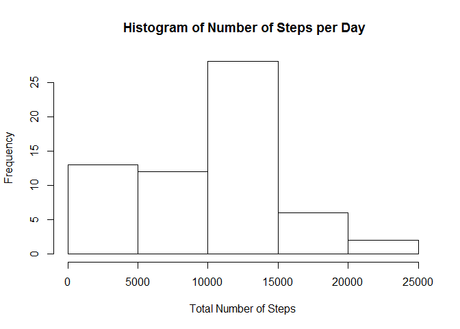
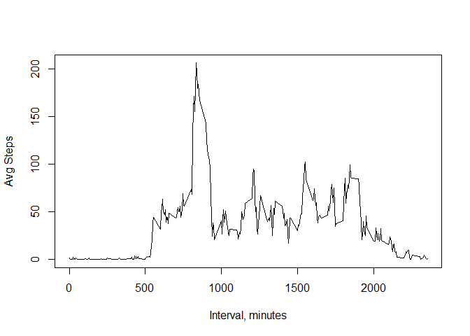
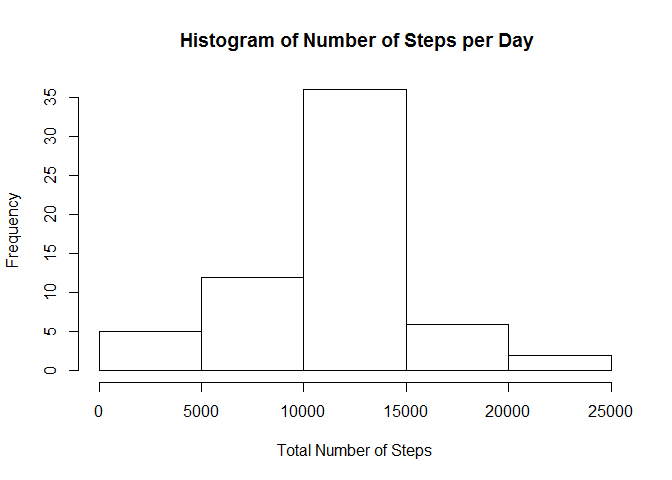
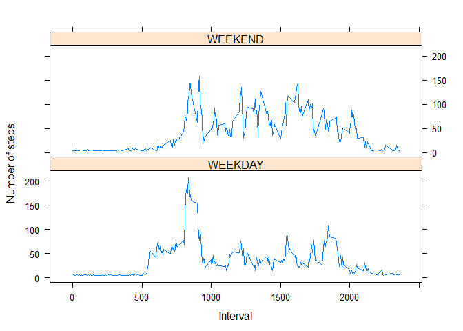

# Reproducible Research: Peer Assessment 1


#Loading and preprocessing the data

```r
setwd("C:/GDrive/Coursera/ReproducibleResearch/Peer1")

rawdata <-read.csv("activity.csv")
```


#What is mean total number of steps taken per day?
##1.Calculate the total number of steps taken per day

Removing NA Values from this point forward

```r
StepsADay <-aggregate(rawdata$steps,by=list(rawdata$date),FUN=sum,na.rm=TRUE)
#Rename Columns
names(StepsADay)<-c("date","totalsteps")
StepsADay
```

```
##          date totalsteps
## 1  2012-10-01          0
## 2  2012-10-02        126
## 3  2012-10-03      11352
## 4  2012-10-04      12116
## 5  2012-10-05      13294
## 6  2012-10-06      15420
## 7  2012-10-07      11015
## 8  2012-10-08          0
## 9  2012-10-09      12811
## 10 2012-10-10       9900
## 11 2012-10-11      10304
## 12 2012-10-12      17382
## 13 2012-10-13      12426
## 14 2012-10-14      15098
## 15 2012-10-15      10139
## 16 2012-10-16      15084
## 17 2012-10-17      13452
## 18 2012-10-18      10056
## 19 2012-10-19      11829
## 20 2012-10-20      10395
## 21 2012-10-21       8821
## 22 2012-10-22      13460
## 23 2012-10-23       8918
## 24 2012-10-24       8355
## 25 2012-10-25       2492
## 26 2012-10-26       6778
## 27 2012-10-27      10119
## 28 2012-10-28      11458
## 29 2012-10-29       5018
## 30 2012-10-30       9819
## 31 2012-10-31      15414
## 32 2012-11-01          0
## 33 2012-11-02      10600
## 34 2012-11-03      10571
## 35 2012-11-04          0
## 36 2012-11-05      10439
## 37 2012-11-06       8334
## 38 2012-11-07      12883
## 39 2012-11-08       3219
## 40 2012-11-09          0
## 41 2012-11-10          0
## 42 2012-11-11      12608
## 43 2012-11-12      10765
## 44 2012-11-13       7336
## 45 2012-11-14          0
## 46 2012-11-15         41
## 47 2012-11-16       5441
## 48 2012-11-17      14339
## 49 2012-11-18      15110
## 50 2012-11-19       8841
## 51 2012-11-20       4472
## 52 2012-11-21      12787
## 53 2012-11-22      20427
## 54 2012-11-23      21194
## 55 2012-11-24      14478
## 56 2012-11-25      11834
## 57 2012-11-26      11162
## 58 2012-11-27      13646
## 59 2012-11-28      10183
## 60 2012-11-29       7047
## 61 2012-11-30          0
```

##2. If you do not understand the difference between a histogram and a barplot, research the difference between them. Make a histogram of the total number of steps taken each day


```r
hist(StepsADay$totalsteps,
     xlab = "Total Number of Steps",
     main = " Histogram of Number of Steps per Day")
```

 

##3. Calculate and report the mean and median of the total number of steps taken per day

mean

```r
mean(StepsADay$totalsteps)
```

```
## [1] 9354.23
```

median


```r
median(StepsADay$totalsteps)
```

```
## [1] 10395
```

#What is the average daily activity pattern?

##1.Make a time series plot (i.e. type = "l") of the 5-minute interval (x-axis) and the average number of steps taken, averaged across all days (y-axis)

```r
AvgStepsbyInterval<-aggregate(rawdata$steps, by=list(rawdata$interval), FUN=mean,na.rm=TRUE)
#Rename Columns
names(AvgStepsbyInterval)<-c("interval","totalsteps")

plot(AvgStepsbyInterval$interval,
     AvgStepsbyInterval$totalsteps,
     type="l",
     xlab="Interval, minutes",
     ylab="Avg Steps")
```

 

##2. Which 5-minute interval, on average across all the days in the dataset, contains the maximum number of steps?


```r
#find the interval
AvgStepsbyInterval[which(AvgStepsbyInterval$totalsteps == max(AvgStepsbyInterval$totalsteps)),]
```

```
##     interval totalsteps
## 104      835   206.1698
```


#Inputing missing values

##1.Calculate and report the total number of missing values in the dataset (i.e. the total number of rows with NAs)

```r
sum(is.na(rawdata$steps))
```

```
## [1] 2304
```


##2.Devise a strategy for filling in all of the missing values in the dataset. The strategy does not need to be sophisticated. For example, you could use the mean/median for that day, or the mean for that 5-minute interval, etc.


```r
#replace na with mean of all intervals

mean(rawdata$steps,na.rm=TRUE)
```

```
## [1] 37.3826
```

##3.Create a new dataset that is equal to the original dataset but with the missing data filled in.

```r
#copy rawdata
mydata<-rawdata

#replace na with mean of all intervals
mydata[is.na(mydata)]<-mean(rawdata$steps,na.rm=TRUE)
```


##4. Make a histogram of the total number of steps taken each day and Calculate and report the mean and median total number of steps taken per day. 

```r
revStepsADay <-aggregate(mydata$steps,by=list(mydata$date),FUN=sum,na.rm=TRUE)
#Rename Columns
names(revStepsADay)<-c("date","totalsteps")
StepsADay
```

```
##          date totalsteps
## 1  2012-10-01          0
## 2  2012-10-02        126
## 3  2012-10-03      11352
## 4  2012-10-04      12116
## 5  2012-10-05      13294
## 6  2012-10-06      15420
## 7  2012-10-07      11015
## 8  2012-10-08          0
## 9  2012-10-09      12811
## 10 2012-10-10       9900
## 11 2012-10-11      10304
## 12 2012-10-12      17382
## 13 2012-10-13      12426
## 14 2012-10-14      15098
## 15 2012-10-15      10139
## 16 2012-10-16      15084
## 17 2012-10-17      13452
## 18 2012-10-18      10056
## 19 2012-10-19      11829
## 20 2012-10-20      10395
## 21 2012-10-21       8821
## 22 2012-10-22      13460
## 23 2012-10-23       8918
## 24 2012-10-24       8355
## 25 2012-10-25       2492
## 26 2012-10-26       6778
## 27 2012-10-27      10119
## 28 2012-10-28      11458
## 29 2012-10-29       5018
## 30 2012-10-30       9819
## 31 2012-10-31      15414
## 32 2012-11-01          0
## 33 2012-11-02      10600
## 34 2012-11-03      10571
## 35 2012-11-04          0
## 36 2012-11-05      10439
## 37 2012-11-06       8334
## 38 2012-11-07      12883
## 39 2012-11-08       3219
## 40 2012-11-09          0
## 41 2012-11-10          0
## 42 2012-11-11      12608
## 43 2012-11-12      10765
## 44 2012-11-13       7336
## 45 2012-11-14          0
## 46 2012-11-15         41
## 47 2012-11-16       5441
## 48 2012-11-17      14339
## 49 2012-11-18      15110
## 50 2012-11-19       8841
## 51 2012-11-20       4472
## 52 2012-11-21      12787
## 53 2012-11-22      20427
## 54 2012-11-23      21194
## 55 2012-11-24      14478
## 56 2012-11-25      11834
## 57 2012-11-26      11162
## 58 2012-11-27      13646
## 59 2012-11-28      10183
## 60 2012-11-29       7047
## 61 2012-11-30          0
```

```r
hist(revStepsADay$totalsteps,
     xlab = "Total Number of Steps",
     main = " Histogram of Number of Steps per Day")
```

 

```r
mean(revStepsADay$totalsteps)
```

```
## [1] 10766.19
```

```r
median(revStepsADay$totalsteps)
```

```
## [1] 10766.19
```
###Do these values differ from the estimates from the first part of the assignment? 
yes


###What is the impact of imputing missing data on the estimates of the total daily number of steps?
A slight increase on the mean, not much affect on median

#Are there differences in activity patterns between weekdays and weekends?

##1.Create a new factor variable in the dataset with two levels - "weekday" and "weekend" indicating whether a given date is a weekday or weekend day.

```r
library("chron")

mydata$weekend = is.weekend(mydata$date)
temp<-mydata

temp$DayType <-ifelse(temp$weekend == FALSE, "WEEKDAY","WEEKEND")
```

##2.Make a panel plot containing a time series plot (i.e. type = "l") of the 5-minute interval (x-axis) and the average number of steps taken, averaged across all weekday days or weekend days (y-axis). See the README file in the GitHub repository to see an example of what this plot should look like using simulated data.

```r
library("lattice")
temp2<-aggregate(temp$steps, by=list(temp$interval,temp$DayType), FUN=mean,na.rm=TRUE)

names(temp2)<-c("interval","daytype","mean")

xyplot(mean ~ interval | daytype, temp2,
       type="l",
       xlab="Interval", 
       ylab="Number of steps", 
       layout=c(1,2))
```

 
